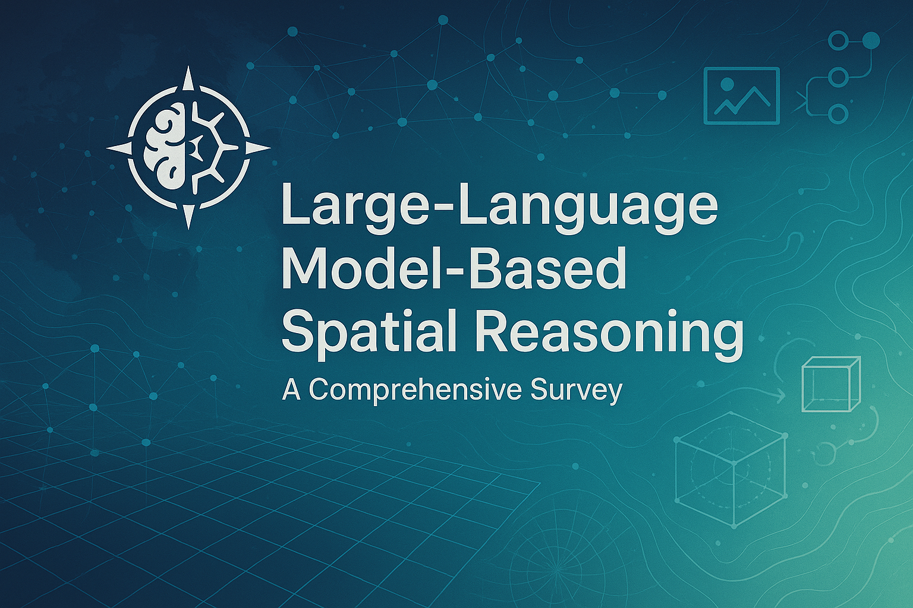

LLM Spatial Reasoning: A Comprehensive Survey

</img>

## About this survey

Large Language Models (LLMs) have revolutionized AI with powerful reasoning and language capabilities, and their extension to visual and embodied tasks has opened new frontiers. *LLM-based spatial reasoning* refers to an LLM’s ability to understand and reason about spatial relationships, geometry, and physical layouts – a fundamental aspect of human cognition. This capability is crucial for tasks ranging from visual question answering about images to guiding robots through rooms. Despite the rapid progress in multimodal LLMs, spatial understanding remains a challenging frontier: recent studies show that even state-of-the-art models struggle with basic spatial concepts like **left vs. right** or **above vs. below**, often performing barely above random chance on controlled tests while humans nearly perfect them. In other words, today’s Vision-Language Models (VLMs) and multimodal LLMs still exhibit significant *spatial intelligence gaps*, sometimes ignoring visual layouts and relying on textual cues instead. This survey provides a structured review of the burgeoning literature (2023–2025) on LLM-based spatial reasoning. We define the area, summarize **recent works**, highlight key benchmarks, notable models, emerging themes, and discuss open problems and future directions.

---

## Surveys 

| Title | Published Year | Authors | Summary | Category |
| --- | --- | --- | --- | --- |
| **Towards Reasoning in Large Language Models: A Survey** | 2023 | Jie Huang *et al.* | Foundational overview of LLM reasoning: prompting, fine-tuning, benchmarks, open questions. | Surveys |
| **Advances in Reasoning by Prompting Large Language Models: A Survey** | 2023 (online ’24) | Ruixin Hong *et al.* | Deep dive into prompt-based techniques (CoT, self-consistency) and reasoning benchmarks. | Surveys |
| **Reasoning with Large Language Models: A Survey** | 2024 | Aske Plaat *et al.* | Extensive taxonomy of CoT-style prompting, reasoning pitfalls, and evaluation challenges. | Surveys |
| **Towards the Reasoning Era: A Survey of Long Chain-of-Thought for Reasoning LLMs** | 2025 | Qiguang Chen *et al.* | Focuses on *long* CoT reasoning, scaling laws, over-thinking, and emerging mitigation methods. | Surveys |
| **LLM as a Mastermind: A Survey of Strategic Reasoning with Large Language Models** | 2024 | Yadong Zhang *et al.* | Surveys strategic / multi-agent reasoning: game play, negotiation, opponent modeling. | Surveys |
| **A Survey on Multimodal Large Language Models** | 2024 | Shukang Yin *et al.* | Broad review of vision-language (and beyond) LLMs: architectures, training, evaluation. | Surveys |
| **A Comprehensive Survey and Guide to Multimodal Large Language Models in Vision-Language Tasks** | 2024 | Chia Xin Liang *et al.* | Practical guide: components, datasets, applications (captioning, storytelling, accessibility). | Surveys |
| **The Revolution of Multimodal Large Language Models: A Survey** | 2024 | Giovanni Suglia *et al.* | Chronicles rise of MLLMs (Flamingo→GPT-4V), highlights multimodal reasoning hurdles. | Surveys |
| **When LLMs Step into the 3D World: A Survey and Meta-Analysis of 3D Tasks via Multi-Modal LLMs** | 2024 (upd. 2025) | Xianzheng Ma *et al.* | Meta-analysis of LLMs handling 3D data: scene understanding, navigation, 3D QA. | Surveys |
| **How to Enable LLM with 3D Capacity? A Survey of Spatial Reasoning in LLM** | 2025 | Jirong Zha *et al.* | Taxonomy of image-, point-cloud-, and hybrid-based methods for spatial reasoning. | Surveys |
| **A Survey of LLM-Powered Spatial Intelligence Across Scales** | 2025 | Jie Feng *et al.* | Unifies spatial reasoning from embodied robots → smart cities → earth-scale remote sensing. | Surveys |
| **Large Language Models for Robotics: A Survey** | 2023 | Fanlong Zeng *et al.* | End-to-end review of LLMs in robotics: perception, planning, control, HRI. | Surveys |
| **A Survey on Integration of Large Language Models with Intelligent Robots** | 2024 | Daehyung Park *et al.* | Framework covering communication, perception, planning, control; prompt-engineering tips. | Surveys |
| **A Survey on LLM-based Autonomous Agents** | 2025 | Lei Wang *et al.* | Taxonomy of LLM agents (tool-using, memory-augmented, multi-agent) across many domains. | Surveys |
| **Augmented Language Models: A Survey** | 2023 | Grégoire Mialon *et al.* | Reviews reasoning- and tool-augmented LMs (retrieval, calculators, code exec) and challenges. | Surveys |

--- 

